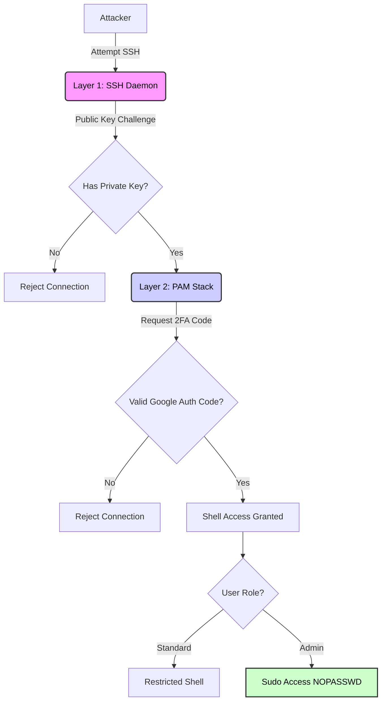
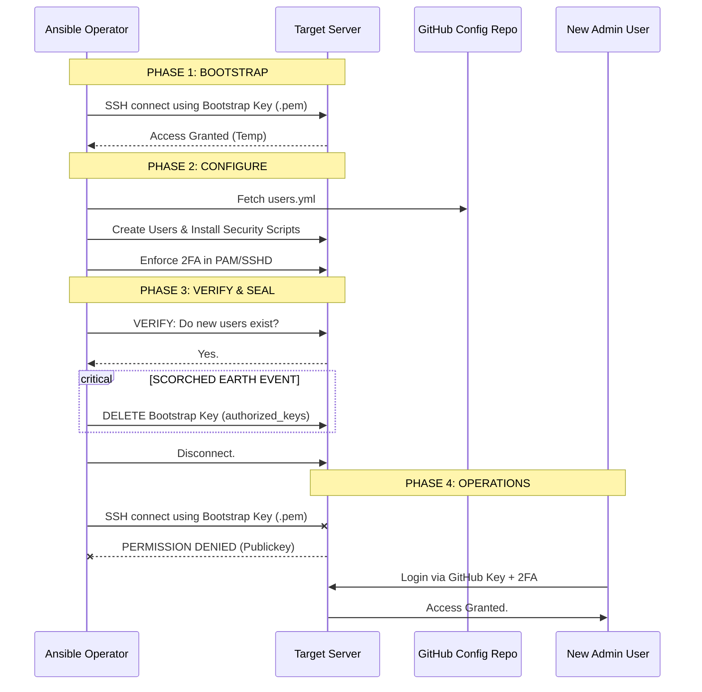

# Secure Server Provisioning: The "Scorched Earth" Protocol

## Overview

This project is an Ansible automation suite designed to provision Ubuntu servers with an extremely high security posture. It moves away from static keys managed on disk and instead adopts a modern, identity-based access model.

It is designed for a **"One-Shot" deployment lifecycle**. It configures identity, enforces strict Multi-Factor Authentication (MFA), and then aggressively removes its own entry mechanism—sealing the server against traditional attack vectors.

### Key Features
* **GitHub as Identity Provider:** SSH public keys are fetched dynamically from GitHub, allowing access control to be managed via Git (Infrastructure as Code).
* **Mandatory 2FA (Google Authenticator):** Every user, including administrators, must use a time-based one-time password (TOTP).
* **Role-Based Access Control (RBAC):** Users are defined in YAML as either standard users or full administrators (sudo).
* **Passwordless Sudo:** Administrators authenticate via strong keys+2FA at the door, allowing seamless sudo access inside without weaker system passwords.
* **"Scorched Earth" Sealing:** The initial bootstrap credentials used by Ansible are irrevocably destroyed at the end of the run.

---

## Security Architecture

Our security model relies on multiple, independent layers of defense. An attacker must compromise a user's physical laptop (private key) **AND** their mobile device (unlocked phone with 2FA app) to gain access.

### The Defense-in-Depth Model



### The "Scorched Earth" Lifecycle

This is the defining feature of this deployment. We use a temporary "Bootstrap Key" (e.g., an AWS `.pem` file) for the initial configuration. Once the new, secure GitHub-based users are verified to be working, the bootstrap key is deleted from the server.

**Once the playbook completes, the original access method is gone forever.**



---

## Prerequisites

1. **Ansible Host:** A machine with Ansible installed (e.g., your laptop).
2. **Target Server:** A fresh Ubuntu 22.04/24.04 server.
3. **Bootstrap Credentials:** The initial SSH private key provided by your cloud provider (e.g., `aws-key.pem`) and the default user (e.g., `ubuntu`).
4. **GitHub Configuration Repo:** A public (or accessible via token) repository containing your `users.yml`.

---

## Configuration

### 1. Define Users (`users.yml`)

Create a YAML file in your GitHub repository to define who gets access and their role.

* `role: admin` gets `sudo` access.
* Other roles get standard shell access.

```yaml
---
- username: cmull-code
  role: admin
  
- username: alice-dev
  role: developer

- username: bob-audit
  role: auditor

```

### 2. Configure Inventory (`inventory.ini`)

Define the IP address of your target server(s) and the bootstrap user.

```ini
[targets]
192.0.2.10  # <-- Replace with Server IP

[targets:vars]
ansible_user=ubuntu
ansible_ssh_common_args='-o StrictHostKeyChecking=no'

```

### 3. Update Playbook Variables (`deploy_server.yml`)

Edit the `vars` section to point to your GitHub repository.

```yaml
  vars:
    admin_user: "ubuntu" # The bootstrap user to be locked out
    user_list_url: "[https://raw.githubusercontent.com/YOUR_GITHUB_USER/YOUR_REPO/main/users.yml](https://raw.githubusercontent.com/YOUR_GITHUB_USER/YOUR_REPO/main/users.yml)"

```

---

## Usage (Running the Playbook)

### ⚠️ Critical Warning

This playbook is designed to run **EXACTLY ONCE** against a fresh server. It will delete the credentials you use to run it. Do not run this on an already-configured production server unless you intend to lock yourself out of the bootstrap account.

### Execution

1. **Load your bootstrap key** into SSH agent (this avoids putting the private key path in files):
```bash
ssh-add path/to/bootstrap_key.pem

```


2. **Run the playbook:**
```bash
ansible-playbook -i inventory.ini deploy_server.yml

```


**What happens next:**

* Ansible installs necessary packages.
* It creates the users defined in your YAML.
* It configures SSHD and PAM for mandatory 2FA.
* It grants passwordless sudo to admins.
* **Final Step:** It deletes the `authorized_keys` file for the `ubuntu` user, sealing the server.

---

## User Onboarding: The 2FA Flow

This is the experience for a new user listed in `users.yml` logging in for the very first time.

### The First Login (Enrollment)

The system detects that the user has not set up 2FA yet. A special "trap" script intercepts the login session and forces enrollment before a shell is granted.

1. The user SSHes in normally: `ssh username@server-ip`
2. Their SSH key is accepted.
3. The terminal clears, and a large QR code is displayed.
4. The user scans this with Google Authenticator (or Authy, etc.).
5. The user enters the 6-digit code displayed on their phone into the terminal.
6. **Success:** The connection closes. Enrollment is complete.

### Subsequent Logins (Enforcement)

For every future login, the user must provide both their key and the current code.

1. User runs: `ssh username@server-ip`
2. SSH Key is accepted silently.
3. Server prompts: `Verification code:`
4. User enters current 6-digit code from app.
5. Access granted.

```

```